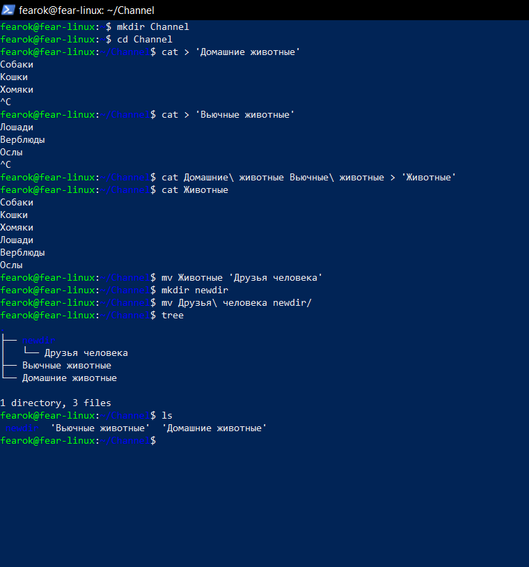
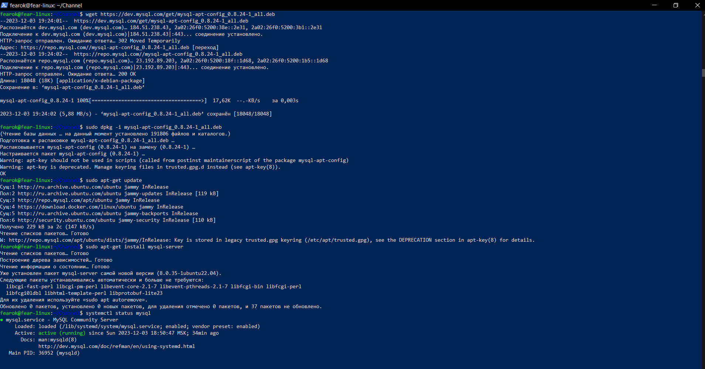
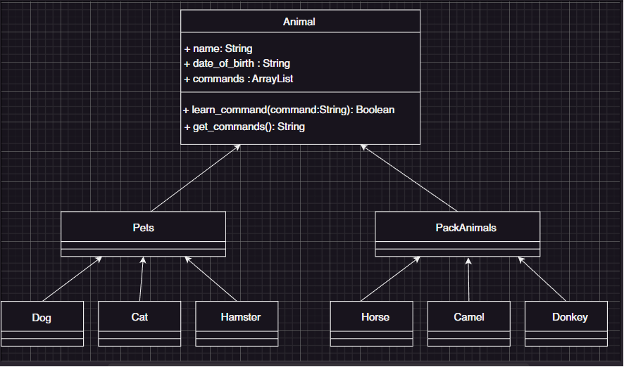

# ```Итоговая контрольная работа по блоку специализация```

## *Информация о проекте*
Необходимо организовать систему учета для питомника в котором живут домашние и вьючные животные.

## *Как сдавать проект*
Для сдачи проекта необходимо создать отдельный общедоступный репозиторий(Github, gitlub, или Bitbucket). Разработку вести в этом репозитории, использовать пул реквесты на изменения. Программа должна запускаться и работать, ошибок при выполнении программы быть не должно. Программа, может использоваться в различных системах, поэтому необходимо разработать класс в виде конструктора.

## ```Задание:```

### 1. Используя команду cat в терминале операционной системы Linux, создать два файла Домашние животные (заполнив файл собаками,кошками,хомяками) и Вьючные животными заполнив файл Лошадьми, верблюдами и ослы, а затем объединить их. Просмотреть содержимое созданного файла. Переименовать файл, дав ему новое имя (Друзья человека).

cat > 'Домашние животные'

В открывшемся файле указываем Собаки Кошки Хомяки

cat > 'Вьючные животные'

В открывшемся файле указываем Лошади Верблюды Ослы

cat 'Домашние животные' 'Вьючные животные' > Животные

ls

mv Животные 'Друзья человека'

ls

### 2. Создать директорию, переместить файл туда.

mkdir newdir

mv 'Друзья человека' newdir/

ls



### 3. Подключить дополнительный репозиторий MySQL. Установить любой пакет из этого репозитория.

Скачиваем конфигуратор mysql:

wget https://dev.mysql.com/get/mysql-apt-config_0.8.24-1_all.deb

sudo dpkg -i mysql-apt-config_0.8.24-1_all.deb

В процессе установки жмем Ок, чтобы выполнить полную установку

Обновляем информацию о пакетах и видим подключенный репозиторий mysql:

sudo apt-get update

Устанавливаем mysql-server:

sudo apt-get install mysql-server

Проверяем результат установки:

systemctl status mysql



### 4. Установить и удалить deb-пакет с помощью dpkg.

Скачиваем пакет для установки:

wget https://dev.mysql.com/get/Downloads/Connector-J/mysql-connector-j_8.0.32-1ubuntu22.04_all.deb

Устанавливаем пакет mysql-connector-j_8.0.32-1ubuntu22.04_all.deb:

sudo dpkg - i mysql-connector-j_8.0.32-1ubuntu22.04_all.deb

Удаляем пакет и его сопутствующие пакеты:

sudo dpkg -r mysql-connector-j

sudo apt-get autoremove

### 5. Выложить историю команд в терминале ubuntu.

Для получения истории введенных команд в терминале ubuntu используем:

history


### 6. Нарисовать [диаграмму](https://github.com/Fearenok/Final-work/blob/main/class_diagram.drawio), в которой есть класс родительский класс, домашние животные и вьючные животные, в составы которых в случае домашних животных войдут классы: собаки, кошки, хомяки, а в класс вьючные животные войдут: Лошади, верблюды и ослы.



### 7. В подключенном MySQL репозитории создать базу данных “Друзья человека”
### 8. Создать таблицы с иерархией из диаграммы в БД.
### 9. Заполнить низкоуровневые таблицы именами(животных), командами которые они выполняют и датами рождения.
### 10. Удалив из таблицы верблюдов, т.к. верблюдов решили перевезти в другой питомник на зимовку. Объединить таблицы лошади, и ослы в одну таблицу.
### 11.Создать новую таблицу “молодые животные” в которую попадут все животные старше 1 года, но младше 3 лет и в отдельном столбце с точностью до месяца подсчитать возраст животных в новой таблице.
### 12. Объединить все таблицы в одну, при этом сохраняя поля, указывающие на прошлую принадлежность к старым таблицам.

### [Cкрипт 8-12 заданий](sql_script.sql)

### 13. [Создать класс](Animals) с Инкапсуляцией методов и наследованием по диаграмме.

## 14. Написать программу, имитирующую работу реестра домашних животных.

## *В программе должен быть реализован следующий функционал:*

### 14.1 Завести новое животное;
### 14.2 Определять животное в правильный класс;
### 14.3 Увидеть список команд, которое выполняет животное;
### 14.4 Обучить животное новым командам;
### 14.5 Реализовать навигацию по меню.

- Реализовано взаимодействие с БД. Пункты: 
  - 14.1
  - 14.2
  - 14.3
  - 14.4 
- Для работы с БД, необходимо внести данные подключения к БД в [конфигурационный файл](db/ConnectData.java)

### 15.Создайте класс Счетчик, у которого есть метод add(), увеличивающий̆ значение внутренней̆int переменной̆на 1 при нажатие “Завести новое животное” Сделайте так, чтобы с объектом такого типа можно было работать в блоке try-with-resources. Нужно бросить исключение, если работа с объектом типа счетчик была не в ресурсном try и/или ресурс остался открыт. Значение считать в ресурсе try, если при заведения животного заполнены все поля.